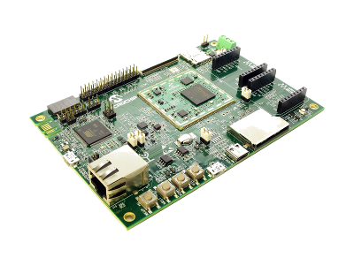
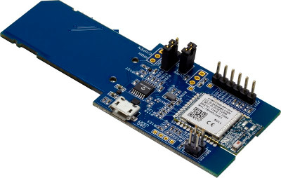

# **build_wilc3000-sd.sh**

<!-- [comment]: <> (Badges -> https://shields.io/#/) -->
<!-- [comment]: <> (Markdown: https://github.com/DavidAnson/markdownlint) -->
<!-- [comment]: <> (Table generator: https://www.tablesgenerator.com/markdown_tables#) -->
<!-- [comment]: <> (Markdown: https://github.com/adam-p/markdown-here/wiki/Markdown-Cheatsheet#emphasis) -->

[![npm version][npm-image]][npm-url]
[![Build status][travis-image]][travis-url]
[![Coverage][coveralls-image]][coveralls-url]
[![License][mchp-image]](#md100)

## 

> Build script to create uSD-Card image for `Microchip WILC3000-SD` & `SAMA5D27-SOM-EK1`

* [Buildroot](https://buildroot.org/)
* [How_to_build_Buildroot_for_AT91](http://www.at91.com/linux4sam/bin/view/Linux4SAM/BuildRootBuild#How_to_build_Buildroot_for_AT91)

<!-- [comment]: <> (Badges: https://shields.io/#/) -->
<!-- [comment]: <> (Markdown: https://github.com/DavidAnson/markdownlint) -->
<!-- [comment]: <> (Table generator: https://www.tablesgenerator.com/markdown_tables#) -->
<!-- [comment]: <> (Markdown: https://github.com/adam-p/markdown-here/wiki/Markdown-Cheatsheet#emphasis) -->

## LICENSE

**[License Agreement](#md100)** *Microchip Non-Exclusive Software License Agreement*

## ***Environment***

| Main Board  |   | SAMA5D27-SOM1-EK1 Development Board ( atsama5d27-som1-ek1 )                     |
|-------------|---|---------------------------------------------------------------------------------|
| WIFI/BT     |   | ATWILC3000 SD Card Evaluation Kit   ( AC164158 )                                |
| J1          |   | Debug header w/ FTDI TTL-232R USB-to-TTL Cable                                  |
| J11         |   | (A5-USB-A) micro-USB to host                                                    |
| SOURCE      |   | [BuildRoot-External](https://github.com/LeoZhang-ATMEL/buildroot-external-wilc) |
| TERMINAL    |   | minicom 2.7                                                                     |
| Host        |   | Linux Ubunutu 16.04.5 LTS                                                       |
| SD Card     |   | Typical 1GB micro-SD card. A Full-size SD-Card adaptor is often needed          |

## Hardware

[SAMA5D27-SOM1-EK1](https://www.microchip.com/developmenttools/ProductDetails/ATSAMA5D27-SOM1-EK1)

<!-- [comment]: <> (Combined image/link) -->

[](https://www.microchip.com/developmenttools/ProductDetails/ATSAMA5D27-SOM1-EK1)

[WILC3000-SD](https://www.microchip.com/developmenttools/ProductDetails/PartNO/AC164158)

<!-- [comment]: <> (Combined image/link) -->

[](https://www.microchip.com/developmenttools/ProductDetails/PartNO/AC164158)

## **STEPS**

### 1.  CREATE AN SD CARD IMAGE

**`Execute this shell script (CLI) from the Host Terminal:`**

```shell
./build_wilc3000-sd_som.sh
```

* All required packages will be `installed`.
* All necessary build steps will be performed.
* Requires about 8.5 GB of additional hard-drive space.
* This will create two folders:

```text
- buildroot-at91
- build-rootexternal
```

* When build is complete, the final image is found here:

> ../buildroot-at91/output/images/`sdcard.img`

### 2.FLASH IMAGE TO micro-SD CARD

```text
Note:
You may use any software you are comfortable with to flash the micro-SD card.
Etcher is only a suggestion.
```

> Download, install and use [Etcher](https://www.balena.io/etcher/) to Flash the uSD Card.

<!-- [comment]: <> (For line breaks, with HTML tags, put two-spaces @ the end of the line) -->
***Notes:***

* `Resin.io` (original Etcher) changes name to `Balena`, releases open-source Oct 2018
* [Etcher Github](https://github.com/balena-io/etcher) - get source (not required)
* [Built with Electron](https://electonjs.org/) - cross-platform desktop apps
* For additional details: [SDCardBootNotice][4].

### 3. ATTACH WILC3000-SD CARD to **`POWER-UP`** SOM BOARD

* J11 (micro-USB) to Host USB

### 4. RUN FROM YOUR `HOST` TERMINAL

#### `Prep 1 of 3`

Check permissions  to serial devices:

```bash
ls -ls /dev/ttyS* /dev/ttyU*
0 crw-rw---- 1 root dialout 4, 64 Dec  4 06:57 /dev/ttyS0
0 crw-rw---- 1 root dialout 4, 65 Dec  4 06:57 /dev/ttyS1
0 crw-rw---- 1 root dialout 4, 66 Dec  4 06:57 /dev/ttyS2
:
:
```

#### `Prep 2 of 3`

Add *`username`* to **dialout group** to enable serial port access:

```bash
sudo username -a -G dialout username
```

#### `Prep 3 of 3`

Ensure `user` belongs to `dialout`

```bash
groups username
```

> `username` : `username` adm `dialout` cdrom sudo dip plugdev fuse lpadmin sambashare

Lastly, run **minicom**

```shell
sudo minicom -wD /dev/ttyACM0
```


### 5. INSERT uSD CARD INTO `J14` AND PRESS **PB1** (Reset)

Login with **root** ( *no password required* )

```shell
Welcome to the Microchip WILC Demo
sama5 login:

sama5_login: root
#
# uname -a
# Linux sama5 4.14.73-linux4sam_6.0 #1 Tue Nov 27 15:27:44 PST 2018 armv7l GNU/Linux
`````

#### *Note:*

If you experience issues while interfacing with the SOM board, an update of your board might be required.  
Follow the directions found in this folder (WINDOWS executable):

```text
 /SOM_JLINK_FIX_WIN/180712_Microchip_PrelimFixSAM3U_OB_VCOM.zip
 ```

#### **Attribution**

* Thanks to Leo Zhang for `buildroot-external-wilc`
* Thanks to David Anson for `markdownlint`

 _Buildroot-External_ ([GPLv2][2]) : [Leo Zhang](https://github.com/LeoZhang-ATMEL/buildroot-external-wilc)  
 _Markdownlint_ ([MIT][license-url]) : [David Anson](https://github.com/DavidAnson/markdownlint)

## `Todo`

> build_wilc3000-sd_som_v2.sh:

* check ubuntu version, warn if not same ...
* disable breakpoints before publishing.
* add color to end-report
* add color to image location // re-format for viewing

> gitlab.com
* Create public repo
* Write ci script & run ci/cd on laptop first ( gitlab-ci)
* find appropriate docker image (gitlab-ci)

> Usage
* Add steps to connect to WiFi / BT.
* Create transparent backgrounds for img's; remove 'white'

> Docker
* Create docker image w/ all build-tools

>  
> ## **END**  
>  

## HISTORY

* 0.0.1 - Initial release.
* 0.0.2 - Improve documentation, tests, and code.

## LICENSE AGREEMENT

[npm-image]: https://img.shields.io/npm/v/markdownlint.svg
[npm-url]: https://www.npmjs.com/package/markdownlint
[travis-image]: https://img.shields.io/travis/DavidAnson/markdownlint/master.svg
[travis-url]: https://travis-ci.org/DavidAnson/markdownlint
[coveralls-image]: https://img.shields.io/coveralls/DavidAnson/markdownlint/master.svg
[coveralls-url]: https://coveralls.io/r/DavidAnson/markdownlint
[license-image]: https://img.shields.io/npm/l/markdownlint.svg
[license-url]: https://opensource.org/licenses/MIT
[mchp-image]: https://img.shields.io/badge/license-microchip-brightgreen.svg
[mchp-url]: #100

<!-- [comment]: <> (https://www.microchip.com/mplab/microchip-libraries-for-applications/mla-license) -->

<!-- [comment]: <> (from Leo Zhang's README.md) -->
[1]: https://buildroot.org/downloads/manual/manual.html#outside-br-custom
[2]: https://www.gnu.org/licenses/old-licenses/gpl-2.0.en.html
[3]: https://buildroot.org/docs.html
[4]: http://www.at91.com/linux4sam/bin/view/Linux4SAM/SDCardBootNotice
[5]: https://etcher.io/

<a id="md100"></a>

## **`Microchip Non-Exclusive Software License Agreement`**

*MICROCHIP IS WILLING TO LICENSE THE ACCOMPANYING SOFTWARE AND DOCUMENTATION TO YOU ONLY ON THE CONDITION THAT YOU ACCEPT ALL OF THE FOLLOWING TERMS.*

*TO ACCEPT THE TERMS OF THIS LICENSE, PROCEED WITH THE DOWNLOAD OR INSTALL.*

***IF YOU DO NOT ACCEPT THESE LICENSE TERMS, DO NOT DOWNLOAD OR INSTALL THIS SOFTWARE.***

MICROCHIP IS WILLING TO LICENSE THE ACCOMPANYING SOFTWARE AND DOCUMENTATION TO YOU ONLY ON THE CONDITION THAT YOU ACCEPT ALL OF THE FOLLOWING TERMS.  TO ACCEPT THE TERMS OF THIS LICENSE, CLICK "I ACCEPT" AND PROCEED WITH THE DOWNLOAD OR INSTALL.  IF YOU DO NOT ACCEPT THESE LICENSE TERMS, CLICK "I DO NOT ACCEPT," AND DO NOT DOWNLOAD OR INSTALL THIS SOFTWARE.

```text
 This Microchip Nonexclusive Software License Agreement ("Agreement") is a contract between you, your heirs, successors and assigns ("Licensee") and Microchip Technology Incorporated, a Delaware corporation, with a principal place of business at 2355 W. Chandler Blvd., Chandler, AZ 85224-6199, and its subsidiaries including, Microchip Technology (Barbados) II Incorporated (collectively, "Microchip") for the accompanying Microchip software, including any PC programs, and any modifications or updates thereto (collectively, the "Software"), and accompanying documentation, including images and any other graphic resources provided by Microchip ("Documentation").

1. Definitions.  As used in this Agreement, the following capitalized terms will have the meanings defined below:

a. "Microchip Products" means Microchip integrated circuit devices.

b. "Licensee Products" means Licensee products that use or incorporate Microchip Products.

c. "Third Party" means Licensee’s agents, distributors, consultants, clients, customers, contract manufacturers, resellers, or representatives.

d. "Third Party Products" means Third Party products that use or incorporate Microchip Products.

2. Software License Grant.  Microchip grants strictly to Licensee a non-exclusive, non-transferable, worldwide license:

a. To use the Software in connection with Licensee Products or Third Party Products;

b. If source code is provided by Microchip to Licensee, to modify the Software for the sole purpose of rendering the Software operable with Licensee Products or Third Party Products, provided that Licensee clearly notifies Third Parties regarding the source of such modifications; and

c. To distribute the Software to Third Parties for use with or incorporation into Licensee Products or Third Party Products, provided that Licensee ensures that: (i) such Third Party agrees to be bound by this Agreement (in writing or by "click to accept"), and (ii) this Agreement accompanies such distribution.  The procedure described in sub-clauses (i) and (ii) is not required when the Software is embedded in machine-readable object code form as firmware in Licensee Products or Third Party Products.  Further, the procedure described in sub-clauses (i) and (ii) is not required when modified versions of PC programs are re-distributed in machine-readable object code form, provided that Licensee notifies end users that: (1) the modified PC program is derived from a Microchip PC program and is governed by the terms of this Agreement including the requirement to use such program with Microchip Products, (2) a copy of this Agreement is available upon request, and (3) the Licensee supports the modified PC program.  

For purposes of clarity, Licensee may NOT embed the Software on a non-Microchip Product, except as expressly described in this Section 2 or the Documentation.  

3. Documentation License Grant.  Microchip grants to Licensee a non-exclusive, non-transferable, worldwide license to use the Documentation in support of the authorized use of the Software as set forth in this Agreement.

4. Third Party Requirements.  Licensee acknowledges that it is Licensee’s responsibility to comply with any third party license terms or requirements applicable to the use of such third party software, specifications, systems, or tools.  This includes, by way of example but not as a limitation, any standards setting organizations requirements and, particularly with respect to Security Package Software, if any, local encryption laws and requirements.  Microchip is not responsible and will not be held responsible in any manner for Licensee’s failure to comply with such applicable third party terms or requirements.

5. Open Source Components.  Notwithstanding the license grant in Section 2 above, Licensee further acknowledges that certain components of the Software may be covered by so-called "open source" software licenses ("Open Source Components").  Open Source Components means any software licenses approved as open source licenses by the Open Source Initiative or any substantially similar licenses, including without limitation any license that, as a condition of distribution of the software licensed under such license, requires that the distributor make the software available in source code format.  To the extent required by the licenses covering Open Source Components, the terms of such license will apply in lieu of the terms of this Agreement.  To the extent the terms of the licenses applicable to Open Source Components prohibit any of the restrictions in this Agreement with respect to such Open Source Components, such restrictions will not apply to such Open Source Component.

6. Licensee Obligations.  Licensee will not: (a) engage in unauthorized use, modification, disclosure or distribution of Software or Documentation, or its modifications or derivatives; (b) use all or any portion of the Software, Documentation, or its modifications or derivatives except in conjunction with Microchip Products, Licensee Products, or Third Party Products as set forth in this Agreement; or (c) reverse engineer (by disassembly, decompilation or otherwise) Software or any portion thereof.  Licensee may not remove or alter any Microchip copyright or other proprietary rights notice posted in any portion of the Software or Documentation.  Licensee will defend, indemnify and hold Microchip and its subsidiaries harmless from and against any and all claims, costs, damages, expenses (including reasonable attorney's fees), liabilities, and losses, including without limitation: (x) any claims directly or indirectly arising from or related to the use, modification, disclosure or distribution of the Software, Documentation, or any intellectual property rights related thereto; (y) the use, sale and distribution of Licensee Products or Third Party Products; and (z) breach of this Agreement.  

7. Confidentiality.  Licensee agrees that the Software (including but not limited to the source code, object code and library files) and its modifications or derivatives, Documentation and underlying inventions, algorithms, know-how and ideas relating to the Software and the Documentation are proprietary information belonging to Microchip and its licensors ("Proprietary Information").  Except as expressly and unambiguously allowed herein, Licensee will hold in confidence and not use or disclose any Proprietary Information and will similarly bind its employees and Third Party(ies) in writing.  Proprietary Information will not include information that: (i) is in or enters the public domain without breach of this Agreement and through no fault of the receiving party; (ii) the receiving party was legally in possession of prior to receiving it; (iii) the receiving party can demonstrate was developed by the receiving party independently and without use of or reference to the disclosing party's Proprietary Information; or (iv) the receiving party receives from a third party without restriction on disclosure.  If Licensee is required to disclose Proprietary Information by law, court order, or government agency, License will give Microchip prompt notice of such requirement in order to allow Microchip to object or limit such disclosure.  Licensee agrees that the provisions of this Agreement regarding unauthorized use and nondisclosure of the Software, Documentation and related Proprietary Rights are necessary to protect the legitimate business interests of Microchip and its licensors and that monetary damage alone cannot adequately compensate Microchip or its licensors if such provisions are violated.  Licensee, therefore, agrees that if Microchip alleges that Licensee or Third Party has breached or violated such provision then Microchip will have the right to injunctive relief, without the requirement for the posting of a bond, in addition to all other remedies at law or in equity.

8. Ownership of Proprietary Rights.  Microchip and its licensors retain all right, title and interest in and to the Software and Documentation including, but not limited to all patent, copyright, trade secret and other intellectual property rights in the Software, Documentation, and underlying technology and all copies and derivative works thereof (by whomever produced).  Licensee and Third Party use of Software modifications and derivatives is limited to the license rights described in this Agreement.

9. Termination of Agreement.  Without prejudice to any other rights, this Agreement terminates immediately, without notice by Microchip, upon a failure by Licensee or Third Party to comply with any provision of this Agreement.  Upon termination, Licensee and Third Party will immediately stop using the Software, Documentation, modifications and derivatives thereof, and immediately destroy all such copies.

10. Warranty Disclaimers.  THE SOFTWARE AND DOCUMENTATION ARE PROVIDED "AS IS" WITHOUT WARRANTY OF ANY KIND, EITHER EXPRESS OR IMPLIED, INCLUDING WITHOUT LIMITATION, ANY WARRANTY OF MERCHANTABILITY, TITLE, NON-INFRINGEMENT AND FITNESS FOR A PARTICULAR PURPOSE.  MICROCHIP AND ITS LICENSORS ASSUME NO RESPONSIBILITY FOR THE ACCURACY, RELIABILITY OR APPLICATION OF THE SOFTWARE OR DOCUMENTATION.  MICROCHIP AND ITS LICENSORS DO NOT WARRANT THAT THE SOFTWARE WILL MEET REQUIREMENTS OF LICENSEE OR THIRD PARTY, BE UNINTERRUPTED OR ERROR-FREE.  MICROCHIP AND ITS LICENSORS HAVE NO OBLIGATION TO CORRECT ANY DEFECTS IN THE SOFTWARE.  

11. Limited Liability.  IN NO EVENT WILL MICROCHIP OR ITS LICENSORS BE LIABLE OR OBLIGATED UNDER ANY LEGAL OR EQUITABLE THEORY FOR ANY DIRECT OR INDIRECT DAMAGES OR EXPENSES INCLUDING BUT NOT LIMITED TO INCIDENTAL, SPECIAL, INDIRECT, PUNITIVE OR CONSEQUENTIAL DAMAGES, LOST PROFITS OR LOST DATA, COST OF PROCUREMENT OF SUBSTITUTE GOODS, TECHNOLOGY, SERVICES, OR ANY CLAIMS BY THIRD PARTIES (INCLUDING BUT NOT LIMITED TO ANY DEFENSE THEREOF), OR OTHER SIMILAR COSTS.  The aggregate and cumulative liability of Microchip and its licensors for damages hereunder will in no event exceed $1000 or the amount Licensee paid Microchip for the Software and Documentation, whichever is greater.  Licensee acknowledges that the foregoing limitations are reasonable and an essential part of this Agreement.

12. General.  THIS AGREEMENT WILL BE GOVERNED BY AND CONSTRUED UNDER THE LAWS OF THE STATE OF ARIZONA AND THE UNITED STATES WITHOUT REGARD TO CONFLICTS OF LAWS PROVISIONS.  Licensee agrees that any disputes arising out of or related to this Agreement, Software or Documentation will be brought exclusively in either the U.S. District Court for the District of Arizona, Phoenix Division, or the Superior Court of Arizona located in Maricopa County, Arizona.  This Agreement will constitute the entire agreement between the parties with respect to the subject matter hereof.  It will not be modified except by a written agreement signed by an authorized representative of Microchip.  If any provision of this Agreement will be held by a court of competent jurisdiction to be illegal, invalid or unenforceable, that provision will be limited or eliminated to the minimum extent necessary so that this Agreement will otherwise remain in full force and effect and enforceable.  No waiver of any breach of any provision of this Agreement will constitute a waiver of any prior, concurrent or subsequent breach of the same or any other provisions hereof, and no waiver will be effective unless made in writing and signed by an authorized representative of the waiving party.  Licensee agrees to comply with all import and export laws and restrictions and regulations of the Department of Commerce or other United States or foreign agency or authority. The indemnities, obligations of confidentiality, and limitations on liability described herein, and any right of action for breach of this Agreement prior to termination, will survive any termination of this Agreement. Any prohibited assignment will be null and void.  Use, duplication or disclosure by the United States Government is subject to restrictions set forth in subparagraphs (a) through (d) of the Commercial Computer-Restricted Rights clause of FAR 52.227-19 when applicable, or in subparagraph (c)(1)(ii) of the Rights in Technical Data and Computer Software clause at DFARS 252.227-7013, and in similar clauses in the NASA FAR Supplement.  Contractor/manufacturer is Microchip Technology Inc., 2355 W. Chandler Blvd., Chandler, AZ 85224-6199.

If Licensee has any questions about this Agreement, please write to Microchip Technology Inc., 2355 W. Chandler Blvd., Chandler, AZ 85224-6199 USA. ATTN: Marketing.

License Rev. No. 06-010914
```